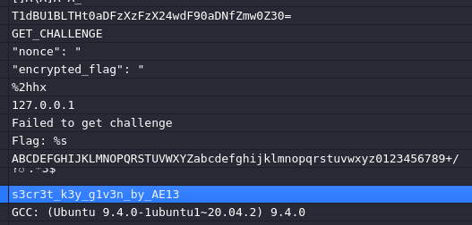

# Deadlocker

You are given a stripped 64‑bit ELF deadlocker and the address of a remote server. The deadlocker contacts the server, receives an encrypted flag, and decrypts it locally. Your task is to reverse‑engineer the binary, understand the cryptographic operations, and write your own client to fetch and decrypt the flag.

Server: lockbox.appsecmy.com 9999

Note: I couldn't solve this challenge on my own as I'm still a Rev beginner. Here's the writeup I referred to for hints: https://www.notion.so/LIGA-CTF-Reverse-Engineering-W1-36a26e605e7e80148a20f032f2fb3da3#36a26e605e7e802baf4dffdb529dca2b

Looking at the strings we find a few interesting stuff



The base64 string is a fake flag, but we see a nonce being passed and also a key given by AE13

Lets look at the code in Ghidra. This function is called first from entry():

```c
bool FUN_00101a51(int param_1,long param_2)

{
  int iVar1;
  long in_FS_OFFSET;
  int local_850;
  int local_84c;
  char *local_848;
  undefined1 local_840 [8];
  undefined1 local_838 [32];
  undefined1 local_818 [1024];
  undefined1 local_418 [1032];
  long local_10;
  
  local_10 = *(long *)(in_FS_OFFSET + 0x28);
  FUN_00101329();
  if (param_1 < 2) {
    local_848 = "127.0.0.1";
  }
  else {
    local_848 = *(char **)(param_2 + 8);
  }
  if (param_1 < 3) {
    local_84c = 9999;
  }
  else {
    local_84c = atoi(*(char **)(param_2 + 0x10));
  }
  iVar1 = FUN_001017b4(local_848,local_84c,local_840,local_818,&local_850);
  if (-1 < iVar1) {
    FUN_0010148f(s_s3cr3t_k3y_g1v3n_by_AE13_00104010,local_840,local_838,0x19);
    FUN_00101667(local_818,local_850,local_838,local_418);
    local_418[local_850] = 0;
    printf("Flag: %s\n",local_418);
  }
  else {
    fwrite("Failed to get challenge\n",1,0x18,stderr);
  }
  if (local_10 != *(long *)(in_FS_OFFSET + 0x28)) {
                    /* WARNING: Subroutine does not return */
    __stack_chk_fail();
  }
  return -1 >= iVar1;
}

```

Overview:

1. `FUN_001017b4()` connects to the server, requests a challenge, and retrieves a nonce + Base64-encoded encrypted flag.
2. `FUN_0010148f()` derives a keystream-like key by performing 8 rounds of bit rotation and XOR operations on a static key (s3cr3t\_k3y\_g1v3n\_by\_AE13) using the nonce.
3. `FUN_00101667()` calls FUN\_001015d0 to generate an LCG-based pseudorandom keystream and XORs it with the received ciphertext to produce the final plaintext.
4. The final buffer is printed as `Flag: %s`.

## FUN\_001017b4()

```c
undefined8
FUN_001017b4(char *param_1,uint16_t param_2,long param_3,undefined8 param_4,undefined4 *param_5)

{
  int __fd;
  int iVar1;
  undefined4 uVar2;
  undefined8 uVar3;
  ssize_t sVar4;
  char *pcVar5;
  char *pcVar6;
  long in_FS_OFFSET;
  int local_104c;
  sockaddr local_1028;
  char local_1018 [4104];
  long local_10;
  
  local_10 = *(long *)(in_FS_OFFSET + 0x28);
  __fd = socket(2,1,0);
  if (__fd < 0) {
    uVar3 = 0xffffffff;
  }
  else {
    local_1028.sa_family = 2;
    local_1028.sa_data._0_2_ = htons(param_2);
    inet_pton(2,param_1,local_1028.sa_data + 2);
    iVar1 = connect(__fd,&local_1028,0x10);
    if (iVar1 < 0) {
      close(__fd);
      uVar3 = 0xffffffff;
    }
    else {
      send(__fd,"GET_CHALLENGE",0xd,0);
      sVar4 = recv(__fd,local_1018,0xfff,0);
      close(__fd);
      if ((int)sVar4 < 1) {
        uVar3 = 0xffffffff;
      }
      else {
        local_1018[(int)sVar4] = '\0';
        pcVar5 = strstr(local_1018,"\"nonce\": \"");
        pcVar6 = strstr(local_1018,"\"encrypted_flag\": \"");
        if ((pcVar5 == (char *)0x0) || (pcVar6 == (char *)0x0)) {
          uVar3 = 0xffffffff;
        }
        else {
          for (local_104c = 0; local_104c < 0x10; local_104c = local_104c + 2) {
            __isoc99_sscanf(pcVar5 + (long)local_104c + 10,"%2hhx",local_104c / 2 + param_3);
          }
          pcVar5 = strchr(pcVar6 + 0x13,0x22);
          if (pcVar5 == (char *)0x0) {
            uVar3 = 0xffffffff;
          }
          else {
            *pcVar5 = '\0';
            uVar2 = FUN_001013b3(pcVar6 + 0x13,param_4,0x400);
            *param_5 = uVar2;
            uVar3 = 0;
          }
        }
      }
    }
  }
  if (local_10 != *(long *)(in_FS_OFFSET + 0x28)) {
                    /* WARNING: Subroutine does not return */
    __stack_chk_fail();
  }
  return uVar3;
}
```

1. Creates a TCP socket and connects to the server using the given IP and port.
2. Sends "GET\_CHALLENGE" and receives a response containing a nonce and an encrypted flag.
3. Parses the response, extracts:

* 16 hex characters → nonce (converted into 8 bytes)
* Base64 string → encrypted flag (decoded later in `FUN_001013b3`)

4. Calls `FUN_001013b3` to process/decrypt the encrypted flag and stores the result length in param\_5.

```c
int FUN_001013b3(char *param_1,long param_2,int param_3)

{
  int iVar1;
  char *pcVar2;
  char *local_30;
  int local_20;
  int local_1c;
  uint local_18;
  
  local_20 = 0;
  local_1c = 0;
  local_18 = 0;
  for (local_30 = param_1; *local_30 != '\0'; local_30 = local_30 + 1) {
    iVar1 = local_1c;
    if ((*local_30 != '=') &&
       (pcVar2 = strchr("ABCDEFGHIJKLMNOPQRSTUVWXYZabcdefghijklmnopqrstuvwxyz0123456789+/",
                        (int)*local_30), pcVar2 != (char *)0x0)) {
      local_18 = (int)pcVar2 - 0x1020c0U | local_18 << 6;
      iVar1 = local_1c + 6;
      if ((7 < local_1c + 6) && (iVar1 = local_1c + -2, local_20 < param_3)) {
        *(char *)(param_2 + local_20) = (char)((int)local_18 >> ((byte)iVar1 & 0x1f));
        local_20 = local_20 + 1;
      }
    }
    local_1c = iVar1;
  }
  return local_20;
}

```

1. Reads a Base64-encoded input string character by character, only processes valid Base64 characters.
2. Converts Base64 characters into a binary stream
3. Extracts bytes and writes decoded output

## FUN\_0010148f()

```c

void FUN_0010148f(void *param_1,long param_2,void *param_3,int param_4)

{
  byte bVar1;
  long in_FS_OFFSET;
  int local_44;
  int local_40;
  int local_3c;
  byte local_38 [40];
  long local_10;
  
  local_10 = *(long *)(in_FS_OFFSET + 0x28);
  memcpy(local_38,param_1,(long)param_4);
  for (local_44 = 0; local_44 < 8; local_44 = local_44 + 1) {
    bVar1 = local_38[0] >> 5;
    for (local_40 = 0; local_40 < param_4 + -1; local_40 = local_40 + 1) {
      local_38[local_40] = local_38[local_40 + 1] >> 5 | local_38[local_40] << 3;
    }
    local_38[param_4 + -1] = local_38[param_4 + -1] << 3 | bVar1;
    for (local_3c = 0; local_3c < param_4; local_3c = local_3c + 1) {
      local_38[local_3c] = local_38[local_3c] ^ *(byte *)(param_2 + local_44);
    }
  }
  memcpy(param_3,local_38,(long)param_4);
  if (local_10 != *(long *)(in_FS_OFFSET + 0x28)) {
                    /* WARNING: Subroutine does not return */
    __stack_chk_fail();
  }
  return;
}
```

1.  The function runs a loop 8 times. Each round modifies the buffer in two stages:

    **(a) Circular bit rotation across the whole buffer (3-bit shift)**

    * Takes the top 3 bits of the first byte.
    * Shifts every byte right by 5 and left by 3 across adjacent bytes.
    * Effectively rotates bits left by 3 across the entire array.

    **(b) XOR with round key byte**

    *   After rotation, each byte is XORed with `nonce[r]` (byte from the nonce)

        ```c
        local_38[i] ^= nonce[r]
        ```
    * Same key byte is applied to all positions in that round.
2. **Write final result to output buffer** After 8 rounds, the transformed buffer is copied to `param_3`:

## FUN\_00101667()

```c

void FUN_00101667(long param_1,int param_2,undefined8 param_3,long param_4)

{
  long lVar1;
  undefined8 uVar2;
  int iVar3;
  ulong uVar4;
  long *plVar5;
  long in_FS_OFFSET;
  long local_58;
  undefined8 local_50;
  int local_44;
  long local_40;
  int local_34;
  long local_30;
  undefined1 *local_28;
  long local_20;
  
  local_40 = param_1;
  local_44 = param_2;
  local_50 = param_3;
  local_58 = param_4;
  local_20 = *(long *)(in_FS_OFFSET + 0x28);
  local_30 = (long)param_2 + -1;
  uVar4 = (((long)param_2 + 0xfU) / 0x10) * 0x10;
  for (plVar5 = &local_58; plVar5 != (long *)((long)&local_58 - (uVar4 & 0xfffffffffffff000));
      plVar5 = (long *)((long)plVar5 + -0x1000)) {
    *(undefined8 *)((long)plVar5 + -8) = *(undefined8 *)((long)plVar5 + -8);
  }
  lVar1 = -(ulong)((uint)uVar4 & 0xfff);
  if ((uVar4 & 0xfff) != 0) {
    *(undefined8 *)((long)plVar5 + ((ulong)((uint)uVar4 & 0xfff) - 8) + lVar1) =
         *(undefined8 *)((long)plVar5 + ((ulong)((uint)uVar4 & 0xfff) - 8) + lVar1);
  }
  iVar3 = local_44;
  uVar2 = local_50;
  local_28 = (undefined1 *)((long)plVar5 + lVar1);
  *(undefined8 *)((long)plVar5 + lVar1 + -8) = 0x101751;
  FUN_001015d0(uVar2,iVar3,(long)plVar5 + lVar1,iVar3,(long)param_2,0);
  for (local_34 = 0; local_34 < local_44; local_34 = local_34 + 1) {
    *(byte *)(local_58 + local_34) = *(byte *)(local_40 + local_34) ^ local_28[local_34];
  }
  if (local_20 != *(long *)(in_FS_OFFSET + 0x28)) {
                    /* WARNING: Subroutine does not return */
    __stack_chk_fail();
  }
  return;
}


void FUN_001015d0(uint *param_1,int param_2,long param_3)

{
  long lVar1;
  long in_FS_OFFSET;
  undefined4 local_18;
  undefined4 local_14;
  
  lVar1 = *(long *)(in_FS_OFFSET + 0x28);
  local_18 = *param_1 & 0x7fffffff;
  for (local_14 = 0; local_14 < param_2; local_14 = local_14 + 1) {
    local_18 = local_18 * 0x41c64e6d + 0x3039 & 0x7fffffff;
    *(char *)(param_3 + local_14) = (char)local_18;
  }
  if (lVar1 != *(long *)(in_FS_OFFSET + 0x28)) {
                    /* WARNING: Subroutine does not return */
    __stack_chk_fail();
  }
  return;
}

```

1. **Calls `FUN_001015d0` to generate a pseudorandom keystream**
   *   `FUN_001015d0(param_1, param_2, buffer)` uses an LCG:

       ```c
       state = state * 0x41c64e6d + 0x3039
       ```
   * Each iteration produces 1 byte from the low bits of the state.
   * Result: `param_2` bytes of pseudorandom data stored in `local_28`.
2. **XORs input data with generated keystream**
   *   For each byte:

       ```c
       output[i] = input[i] ^ keystream[i]
       ```
   * `param_1` = input buffer
   * `local_58` = output buffer
   * `local_28` = keystream from LCG
3. **Writes final transformed output**
   * The XOR result is copied into `param_4` (output buffer).

## Solve script

```python
#!/usr/bin/env python3
import base64
import re
import socket

HOST = "lockbox.appsecmy.com"
PORT = 9999

STATIC_KEY = b"s3cr3t_k3y_g1v3n_by_AE13"


# ----------------------------
# FUN_0010148f
# ----------------------------
def derive_key(key: bytes, nonce: bytes) -> bytes:
    k = bytearray(key)
    n = len(k)

    for r in range(8):
        carry = k[0] >> 5

        for i in range(n - 1):
            k[i] = ((k[i] << 3) & 0xff) | (k[i + 1] >> 5)

        k[-1] = ((k[-1] << 3) & 0xff) | carry

        for i in range(n):
            k[i] ^= nonce[r]

    return bytes(k)


# ----------------------------
# FUN_001015d0
# ----------------------------
def lcg_keystream(seed_bytes: bytes, length: int) -> bytes:
    seed = int.from_bytes(seed_bytes[:4], "big") & 0x7fffffff
    out = bytearray()

    for _ in range(length):
        seed = (seed * 0x41C64E6D + 0x3039) & 0x7fffffff
        out.append(seed & 0xff)

    return bytes(out)


# ----------------------------
# decrypt pipeline
# ----------------------------
def decrypt(ct: bytes, nonce: bytes) -> bytes:
    return bytes(
        c ^ k for c, k in zip(
            ct,
            lcg_keystream(derive_key(STATIC_KEY, nonce), len(ct))
        )
    )


def fetch():
    s = socket.socket()
    s.connect((HOST, PORT))
    s.sendall(b"GET_CHALLENGE")
    return s.recv(4096)


resp = fetch()

nonce = bytes.fromhex(re.search(rb'"nonce"\s*:\s*"([0-9a-fA-F]{16})"', resp).group(1).decode())
ct = base64.b64decode(re.search(rb'"encrypted_flag"\s*:\s*"([A-Za-z0-9+/=]+)"', resp).group(1))

print(decrypt(ct, nonce).rstrip(b"\x00").decode())
```
