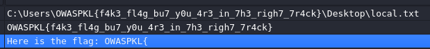

# Detoante2 (Easy)

In malware analysis, you can either statically analyze the assembly codes directly, or you can create a snapshot of your sandbox and detonate it inside.

Straight up reverse this file, and you will find the flag. You may start by debugging it via IDA or Ghidra.

Flag format: OWASPKL{xxx}

I did not do as the question asked an opened the file in DIE to look at the strings



Similar to Proton 1337, I also recognized the fake flagas and how it stores it in Desktop. It was similar to this: https://pis-blog.gitbook.io/blog-of-pi/hack-10-ctf-2026/rev/detonator

However the flag wasnt the same (I really I thought I got lucky again), which is probably why this one is called Detonate2. It probably works similary, so I opened it in Ghidra to check it out.

```c
  local_20 = &local_4a;
  std::__cxx11::string::string<>
            (local_78,
             "C:\\Users\\OWASPKL{f4k3_fl4g_bu7_y0u_4r3_in_7h3_righ7_7r4ck}\\Desktop\\local.txt",
             &local_4a);
  std::__new_allocator<char>::~__new_allocator((__new_allocator<char> *)&local_4a);
  local_28 = &local_49;
  std::__cxx11::string::string<>
            (local_98,"OWASPKL{f4k3_fl4g_bu7_y0u_4r3_in_7h3_righ7_7r4ck}",&local_49);
  std::__new_allocator<char>::~__new_allocator((__new_allocator<char> *)&local_49);
  __file = (char *)std::__cxx11::string::c_str();
  iVar1 = stat(__file,&local_128);
  if (iVar1 == 0) {
    poVar2 = std::operator<<((ostream *)std::cout,"Here is the flag: OWASPKL{");
    md5(local_48);
    poVar2 = std::operator<<(poVar2,local_48);
    std::operator<<(poVar2,"}\n");
    std::__cxx11::string::~string(local_48);
  }

```
It does work the same as the first Detonator. I just need to change the path used.

```python
import hashlib
path_string = r"C:\\Users\\OWASPKL{f4k3_fl4g_bu7_y0u_4r3_in_7h3_righ7_7r4ck}\\Desktop\\local.txt"
md5_hash = hashlib.md5(path_string.encode()).hexdigest()
flag = f"OWASPKL{{{md5_hash}}}"
print(flag)
```

All this script does is it create an MD5 hash of the path string, which what the malware was doing here: ```md5(local_48);```. This gives us the flag.