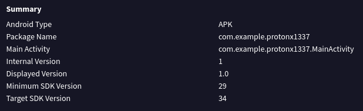
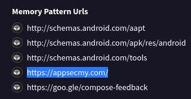

#  Find the C2 Server (Easy)

This APK file is malicious. It secretly talks to a C2 Server. Identify the C2 Server address, and find the flag.

I put the APK into VirusTotal



Ok, so maybe this would be considered cheating (or maybe even luck), but I actually recognzed the package name of the APK Proton X1337 for Hack@10 CTF. It a similar question where we had to find the C2 server as well. This APK contacted the same URL as well, which is the Liga CTF welcome page.



So I decided to inspect the page, which is what I did last time and found this in the source code

```
<!-- OWASPKL{https://chat.whatsapp.com/KAdpus4R0pb895ulC2jo8p} This is the FL4G. But feel free to join our Community Group-->
```

You can check out how I solved this question before here: https://pis-blog.gitbook.io/blog-of-pi/hack-10-ctf-2026/rev/protonx1337


