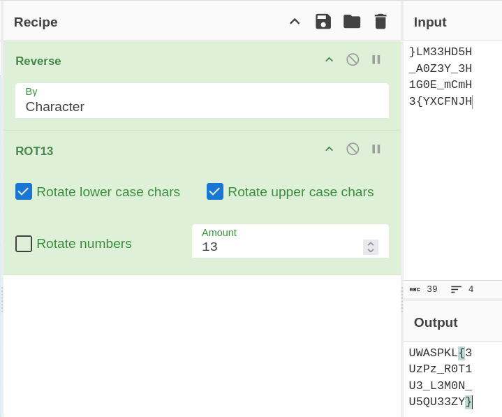

# Lockbox

Your friend just got into learning Cryptography and is very proud of their first project. They built a program called lockbox that hides a secret message inside a binary, then sent it over with a note:

"i used THREE layers of protection — ROT13, reversed the string, and split the data into separate pieces scattered across memory. there's literally no way to get the message without the proper unlock code. try if you think you're so smart lol"

The only documented way to open it is --unlock `, and they never gave you the 64-character unlock code.`

Prove them wrong. Get the message.

Tip: Start with static analysis — run strings on the binary and compare what you find against what your friend claims is inside.

Opening the elf in DIE gives us the following strings

```
}LM33HD5H
_A0Z3Y_3H
1G0E_mCmH
3{YXCFNJH
```

I just put into CyberChef to see what i would get



Ok its jumbled up, here's the flag after some rearranging

OWASPKL{3zPz\_R0T13\_L3M0N\_5QU33ZY}
