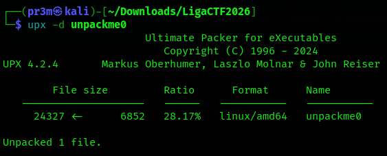
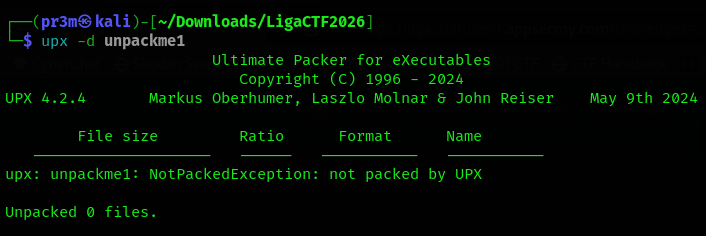
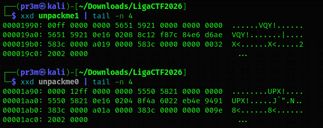
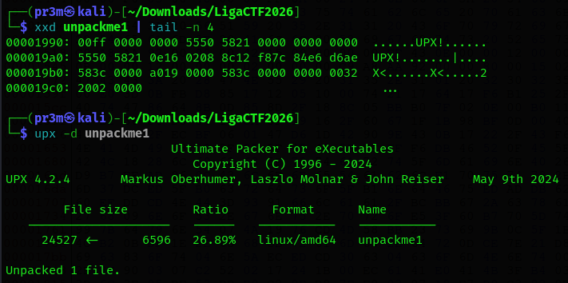
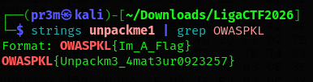
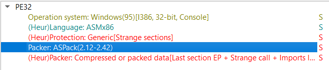
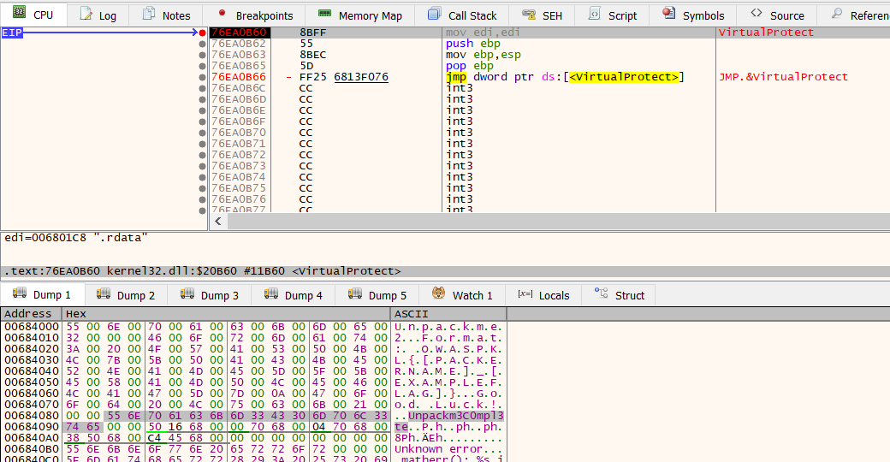

# Unpack Me (3 Challenge Series)

##  unpackme0 - Easy 

Packing is a technique used by malware to obfuscate its functionalities. Malware packers 'pack' the main malicious binary to make static analysis much harder. The malware 'unpacks' during runtime. If this is your first time hearing about packers, it's recommended that you read this article first: https://medium.com/@shellseekerscyber/explainer-packed-malware-16f09cc75035

With that out of the way, your first task is to identify the packer used for this binary, and unpack it. Provide the md5 hash of the unpacked file as your flag. Example: OWASPKL{23ac7b66851387b96a20672b5c0dc856}



```
md5sum unpackme0
1cc6a3b62cac36ab18e0c4685a7f4bdf  unpackme0
```

## unpackme1 - Medium

Well done, by now you should hopefully understand more about packed binaries. Things won't be as straightforward anymore though. A simple anti unpacking technique was applied to this packed binary.

Your next task is the same: identify the packer used for this binary, and unpack it. Instead of getting the file hash, the flag is hidden in the unpacked file as a string. Format: OWASPKL{Im_A_Flag}



Doesnt seem to be packed by UPX. But checking strings says otherwise

```
└─$ strings unpackme1 | grep -i upx
UPX!8
RPhupX
UPX!u
```
Looking and comparing the tail of unpackme1 and unpackme0



Using Bless I changed ```VQY``` to ```UPX`` and now we can unpack the file!



Using strings, we can now get the flag




## unpackme2 - Medium (Post-Event Solve)

Did you know that there are two methods to solve unpackme1? If you used the hard way instead of the smart way, this challenge will be easy for you!

Your next task is the same: identify the packer used for this binary, and unpack it. The flag for this challenge is made up of two parts: The name of the packer (in all caps), and the flag string in the binary. The flag string does NOT follow the OWASPKL{} flag format! It’s simply a string in l33tspeak hidden in the program. The two parts are separated with an underscore (_).

Format: OWASPKL{[PACKERNAME]_[EXAMPLEFLAG]} Example: OWASPKL{MYPACKER_3xampl3Fl4g}

This time the file is an exe

Opening in DIE, we get the packer name



I found a few videos on how to unpack ASPACKed programs using x32dbg and spent a long time trying to do so. Apparently, we dont even need to do that. 

This video is pretty good: https://www.youtube.com/watch?v=L0NwUMU-Pj4

I set some breakpoints at the following addresses

```
VirtualAlloc
VirutalProtect
LoadLibraryW
```

At each breakpoint, I run to user code and followed the dump of EAX to see its contents



I at VirtualProtect, we find the flag in plaintex tin the dump!


