# Operation Breadcrumbs

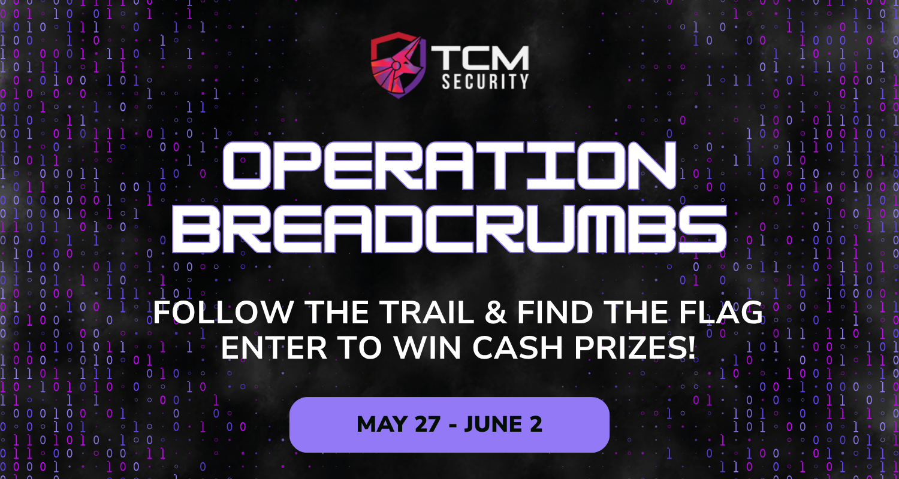

This was a fun little CTF event held by TCM Security. Short and sweet :) 

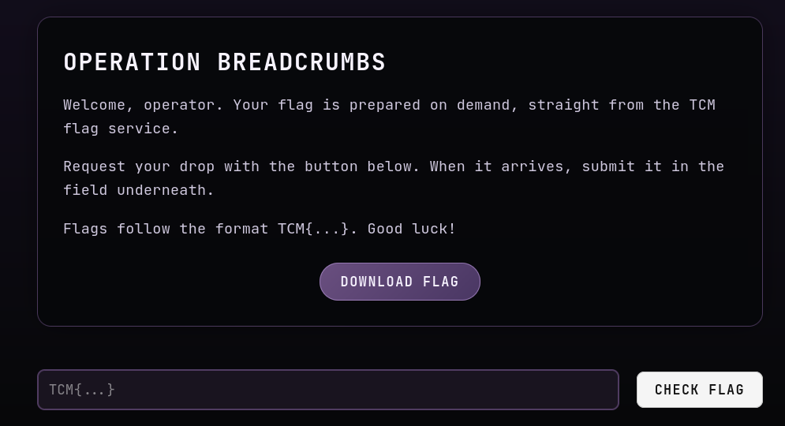

Clicking download flag only gives us an error

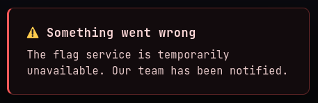

Capturing the Download Flag request on Burpsuite:

Request:

```
GET /api/flag HTTP/2
Host: ctf.tcmsecurity.com
Sec-Ch-Ua-Platform: "Linux"
Accept-Language: en-US,en;q=0.9
Accept: application/json
Sec-Ch-Ua: "Not-A.Brand";v="24", "Chromium";v="146"
User-Agent: Mozilla/5.0 (X11; Linux x86_64) AppleWebKit/537.36 (KHTML, like Gecko) Chrome/146.0.0.0 Safari/537.36
Sec-Ch-Ua-Mobile: ?0
Sec-Fetch-Site: same-origin
Sec-Fetch-Mode: cors
Sec-Fetch-Dest: empty
Referer: https://ctf.tcmsecurity.com/
Accept-Encoding: gzip, deflate, br
Priority: u=1, i
```

Response:

```
HTTP/2 418 I'm a teapot
Date: Wed, 03 Jun 2026 06:10:34 GMT
Content-Type: application/json; charset=utf-8
Content-Length: 74
Server: nginx/1.31.1
X-Debug-Trace: aHR0cHM6Ly9naXN0LmdpdGh1YnVzZXJjb250ZW50LmNvbS9NYWx3YXJlQ3ViZS9mYjA3NDM0YzFmYmEzYjkxNDNjYWU4ZjAxMzA5YTU3Zi9yYXcvNTk4MTRkMGY0MTU4MTMyNWJhZTVjODBiMGRlOTg0NDk2M2Q0NGI0Ny9mbGFnLXNlcnZpY2UtZGVidWctbm90ZXMubWQ=
{"message":"Flag service unavailable","retry_after":null,"status":"error"}
```

Decoding the `X-Debug-Trace` Base 64 gives us:

https://gist.githubusercontent.com/MalwareCube/fb07434c1fba3b9143cae8f01309a57f/raw/59814d0f41581325bae5c80b0de9844963d44b47/flag-service-debug-notes.md


This link leads to this a page with the following content:

```
# upload worker - queue stalls

  worker keeps choking on the bulk import. the per-item debug dump sits on the
  internal api:

      /api/internal/ff9d9e38a38333145e46b49aa4a5f4b6?_=1718041920473&rid=7f3c9a2b1e&debug=1

  grabbed that this morning, was useful. came back after lunch and it's 404.
  of course it is. this is what I get for vibe-coding the whole thing...
  
```

Cracking the MD5 hash `ff9d9e38a38333145e46b49aa4a5f4b6` gives us `IMG27`. So I used a simple script to brute force IMG 1 to IMG100 to see if we get any responses

```python
import requests
import hashlib
import time

base_url = "https://ctf.tcmsecurity.com/api/internal"
rid = "7f3c9a2b1e"

for i in range(1, 100):
    item_id = f"IMG{i}"
    hash_val = hashlib.md5(item_id.encode()).hexdigest()
    timestamp = int(time.time() * 1000)
    url = f"{base_url}/{hash_val}?_={timestamp}&rid={rid}&debug=1"
    
    try:
        r = requests.get(url, timeout=5)
        print(f"IMG{i} [{r.status_code}]: ", end="")
        
        if r.status_code == 200:
            print(f"HIT! -> {r.text[:300]}")
        elif "TCM{" in r.text:
            print(f"FLAG FOUND -> {r.text}")
        else:
            print(f"({len(r.text)} bytes) {r.text[:80]}")
    except requests.exceptions.RequestException as e:
        print(f"Error: {e}")
```
After while, I got a hit for IMG28

```
IMG28 [200]: HIT! -> {"auth_payload":"H4sIAAAAAAAA/wTA7wqCMBAA8He5z6kthUiISiEiUIJGfz6JXtOGbRd6wzR6935fuHkyzTxJrbIQQ/05hdGlwcRMeXFY7cXiuJRVc72bfI6ijZKIREJTCDN46Z61bSCGJ/O7j4NgGAZ/JMeuUj6SCbYyzc4KXad53GH5UGbc9K4qkGytO1OyJrsW8PsHAAD//71EzlGFAAAA","service":"image-processor","status":"ok"}
```

Decoding the payload from Base64 and then Gunzip using CybeChef gives us some valuable info:

```
{"X-TCM-Token":"fxP34VgcBmzN_H9F12J7TbgWYmN0c1k4B4o1Boz3","listing":"https://www.youtube.com/@TCMSecurityAcademy?sub_confirmation=1"}
```

The youtube link leads to TCM Security's YouTube channel, and when looking at their links, we find the next breadcrumb:

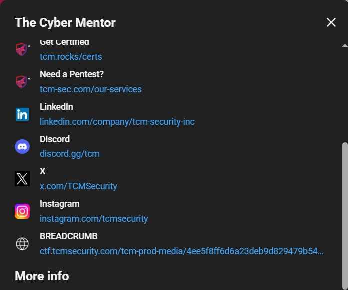

`https://ctf.tcmsecurity.com/tcm-prod-media/4ee5f8ff6d6a23deb9d829479b54c8e3.jpg`

However, clicking this link, we are met with this:

```
<Error>
<Code>AccessDenied</Code>
<Message>Access Denied</Message>
<RequestId>9F3A2C1D7E4B8A60</RequestId>
<HostId>Uf3pK2mWqL8xY1nZ7bV4tR6sD0gH5jC9aE2oP1iM3kS8wB7vN4xQ6lT0yU2rA1c=</HostId>
</Error>
```

I was stuck here for a long time, trying many things. After a few days, I booted up my VM again and looked at the payload once more. The next step was quite straightforward, we send a request to the link with `X-TCM-Token:fxP34VgcBmzN_H9F12J7TbgWYmN0c1k4B4o1Boz3` in the header.

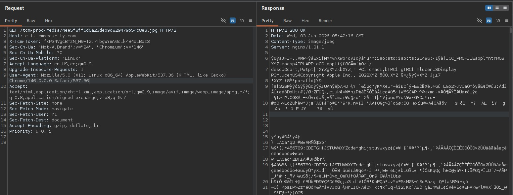

Seeing JFIF in the response, it seems we're getting a JPEG! I downloaded it with curl.

```
curl -o image.jpg \                             
-H "X-TCM-Token: fxP34VgcBmzN_H9F12J7TbgWYmN0c1k4B4o1Boz3" \
"https://ctf.tcmsecurity.com/tcm-prod-media/4ee5f8ff6d6a23deb9d829479b54c8e3.jpg"
```

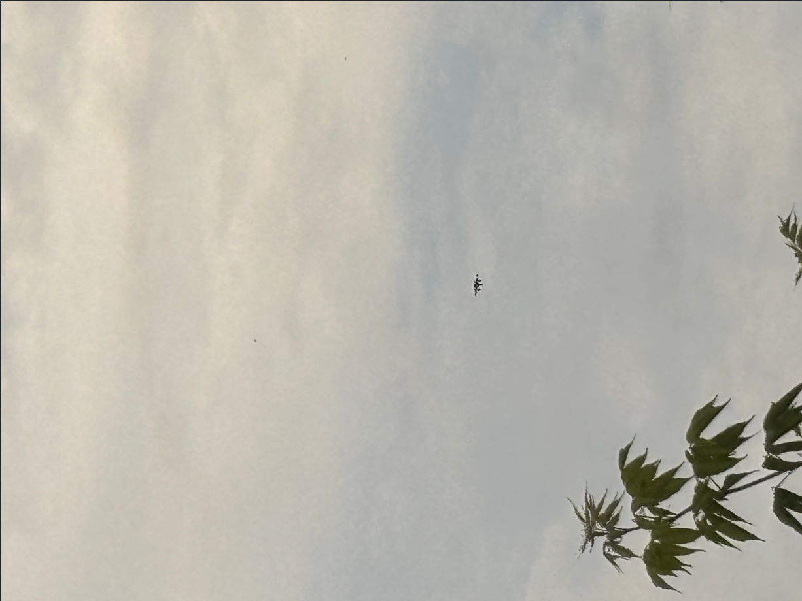

This is the image we got. Looking into its metadata with exiftool, we find some coordinates:

```
GPS Latitude                    : 34 deg 8' 2.76" N
GPS Longitude                   : 118 deg 19' 17.40" W
GPS Position                    : 34 deg 8' 2.76" N, 118 deg 19' 17.40" W
```

Putting these coordinates into Google Maps, it brings us to the iconic Hollywood Sign

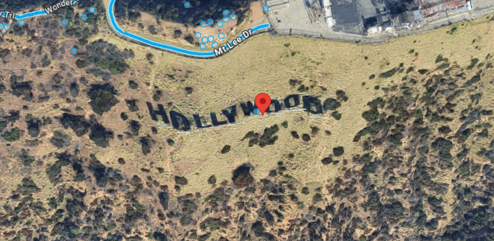

Going back to the image, there seems to be a ZIP archive in the image, I extracted it using `binwalk`

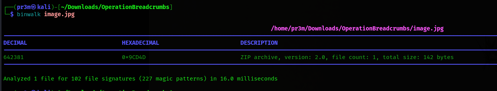

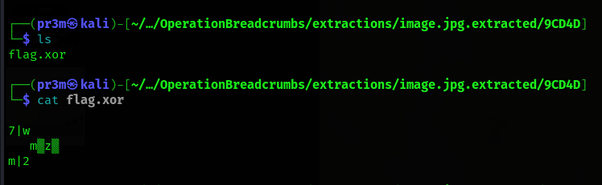

There was a `flag.xor` file in the extracted folder. I copied its contents and put it into CyberChef with the password "HOLLYWOOD" and got the flag!

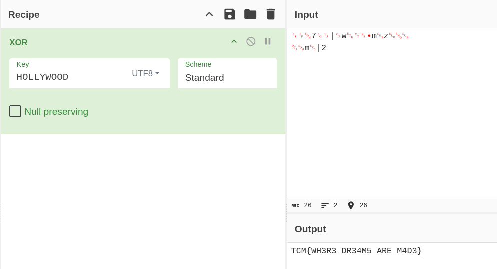

Flag: `TCM{WH3R3_DR34M5_ARE_M4D3}`

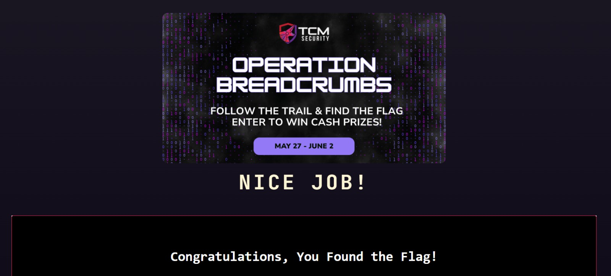
