# Wargames 2024 Writeup - DaemonHunter

## Introduction

Username: DaemonHunter

Team: Penem

Division: Student

Hi! This my writeup on my solves for Wargames 2024. I'm still quite new to CTF, so I did not get many solves. I still had fun participating and I can't wait to do the same next year!

## Forensic

### I Cant Manipulate People

This one is fairly simple, it's one pcap file.

After inscpecting the pcap in Wireshark, when following the ICMP traffic, you can see that one character of the flag is located in ech packet.

Knowing this, we can write a tshark command to extract the data from the end of each ICMP packet

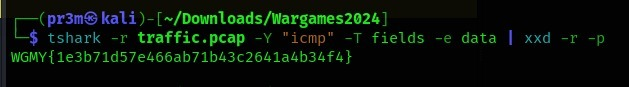

Flag found!

### Unwanted Meow

We are presented with a SHREDDED file.

View in HxD hex editor

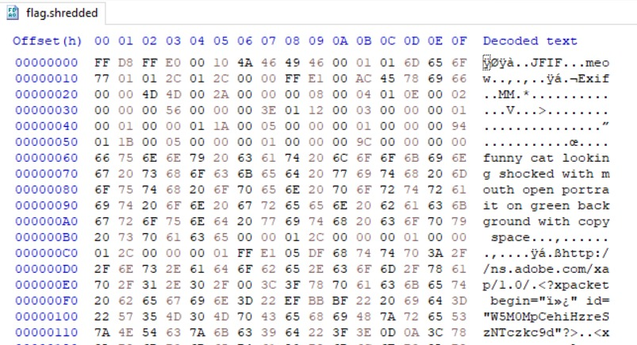

According the maigc number, this is a jpg file

The hex is riddled with "meow"

We can do a simple search and replace for the word meow and replace it with nothing

NOTE: HxD didnt managed to get all the "meow", so I had to open the hex in VSCode and manually find some meows and remove them

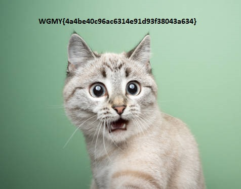

## Misc

### Christmas GIFt

We are give a huge (and long) GIF file

Using stegsolve's frame browser, I just browsed the frames until I found the one with the flag

### Invisible Ink

We are given a GIF that countsdown to a flag reveal, but we can see it

Using stegsolve's frame browser, I just browsed the frames until I found the one two weird frames

 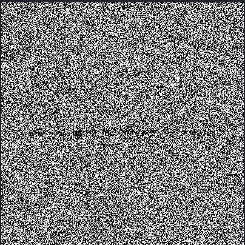

After playing with the color maps in stegsolve, I got this out of the two frames

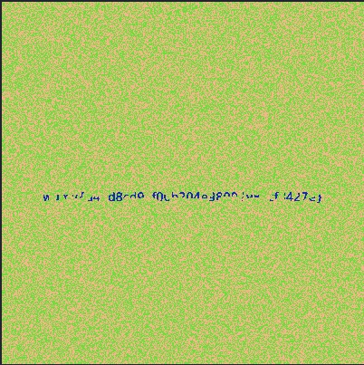 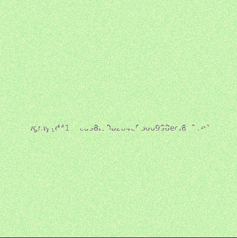

I layered the images in GIMP and played with the opacity, finally getting this:

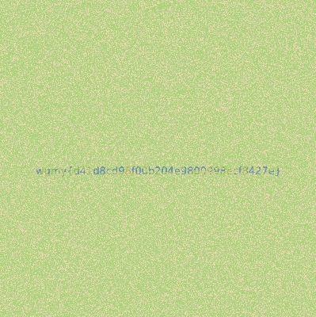

## Crypto

### Credentials

Question: We found a leak of a blackmarket website's login credentials. Can you find the password of the user osman and successfully decrypt it?

We are given 2 .txt files, passwd and user

All we have to do is find "osman" in user.txt and then find the password of the same line in passwd.txt

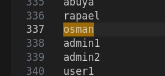

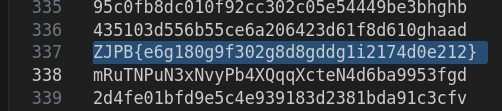

Its encrypted with some sort of ROT cipher. After playing around with the key value in CyberChef, we get the flag

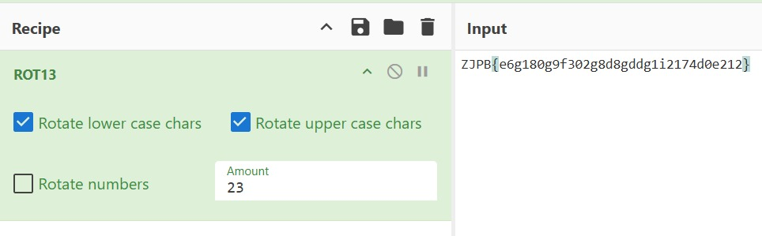

## Reverse

### Stones

Question: When Thanos snapped his fingers, half of the flag was blipped. We need the Avengers to retrieve the other half. There's no flag in the movie, but there is a slash flag on the server

We are given a weird file, stones.whatdis

After running the "file" command, we find that it is an EXE

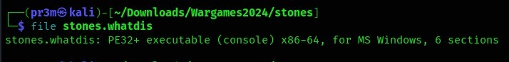

After changing the extension to .exe, I tried running it in my Windows VM.

The file fails to run, but not before opening the cmd and flashing some sort of Python error (It was really quick so I couldn't capture it)

So, I decided to unpack the .exe file back into python files so I can take a look at the code

I followed this guide: https://www.youtube.com/watch?v=jmC-FKNRdvk

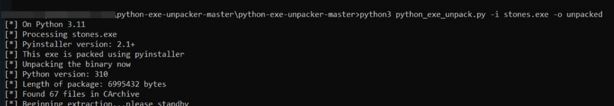

Instead of changing the magic number of the .pyc file, I used an online converter https://pylingual.io/ to convert it into readble code

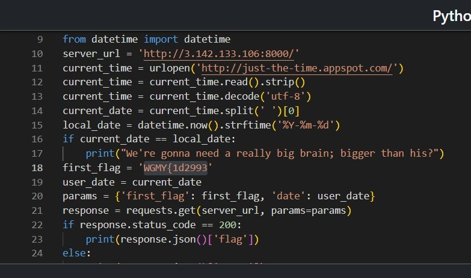

This code sends a carfted request to a server containing a part of the flag and a date

There's a few things here:

* A part of the flag
* A server IP

Navigating to the IP with a "/flag" at the end returns this

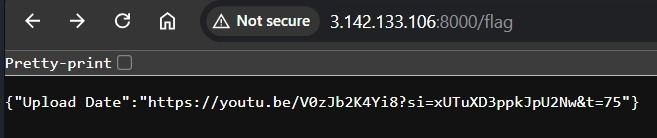

This youtube link is for an Avengers Endgame clip, with the key "Upload Date"

With all this information, I made some changes to the code

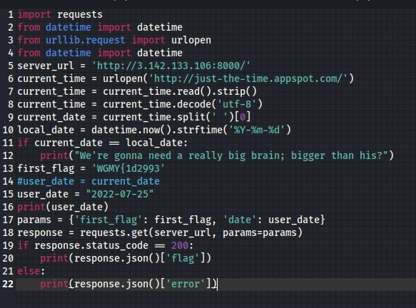

I changed the date the code was using to send the request to the upload date of the youtube video

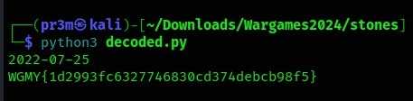

Got the flag!

## Conclusion

Well, that's all the flags I got this time. It's not much but it was fun. I'm looking forward to try again next year. Thanks for reading!
